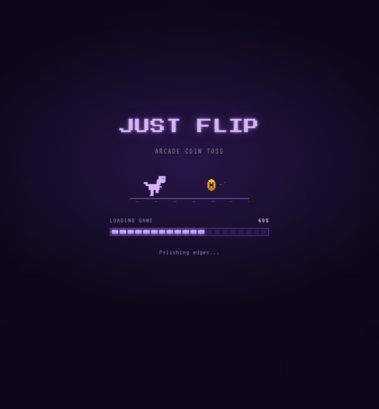
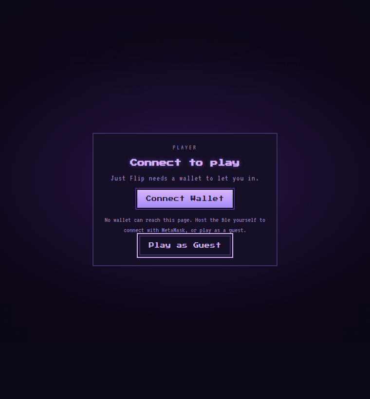
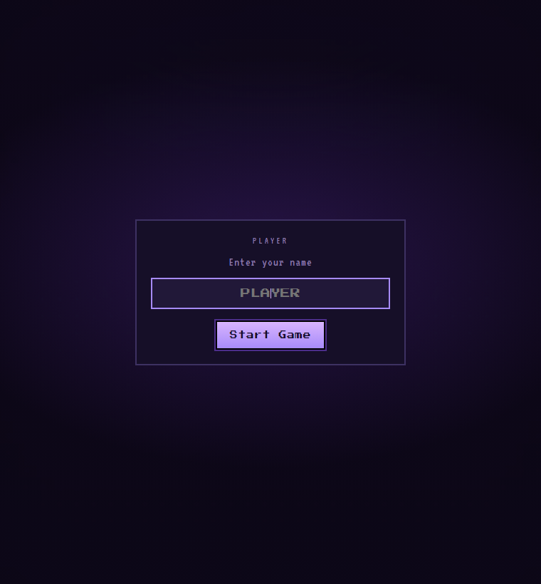
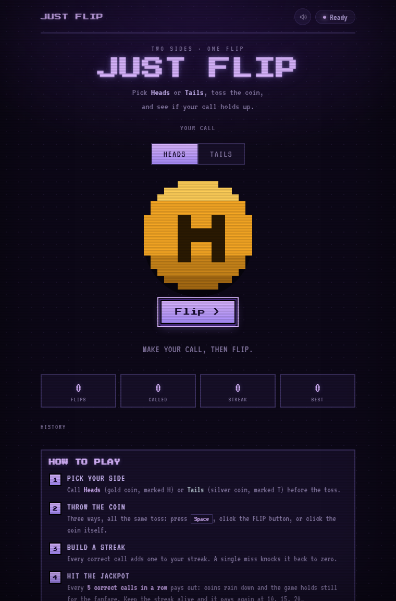
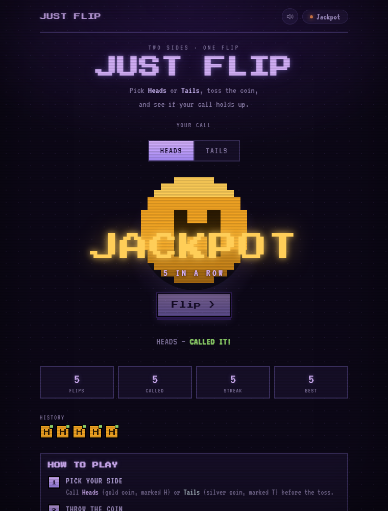

# Just Flip

**Call it in the air. One file, no dependencies.**

A retro arcade coin toss. Call Heads or Tails, throw the coin, and see how long you can keep a streak alive.

[How it plays](#how-it-plays) · [Under the hood](#under-the-hood) · [What's next](#whats-next)

Everything is generated by code. No image files, no audio files, no libraries, no build step. The coin is pixel art drawn in the same HTML file, and the music is synthesized while you play.

Download one file, open it, done.

## How it plays

### Loading

A dinosaur runs after a coin and hurdles cacti while the bar fills. It runs to 100% before the enter button lights up.

### Getting in

Connect a wallet, or play as a guest. The wallet is identity only. Nothing is signed and no funds are touched.

### Your name

Your name is saved with your record. Come in through a wallet and the address becomes the name.

### The board

Pick a side, then throw. Press <kbd>Space</kbd>, click the FLIP button, or click the coin itself.

### The throw

The coin arcs up, tumbles, and lands with a bounce. Gold ring if your call was right, grey if it wasn't.

### Jackpot

Five correct calls in a row pays out. The screen freezes, coins rain down, and a six second fanfare plays. It pays again at 10, 15, and on from there.

## Under the hood

The parts that were harder than they look.

**The coin sound uses inharmonic frequencies.** Metal rings on partials that aren't whole number multiples of the root. That's what separates a real clink from a game blip. The flip is 5 inharmonic partials plus a noise burst for the strike.

**The jackpot melody uses harmonic partials instead.** Inharmonic tones turn to mush the moment you play a tune on them. Two timbres doing two different jobs.

**The flip isn't 3D.** The coin squashes flat, the art swaps while it's thin, then expands. The 3D version was broken for days. A CSS `filter` on the coin silently kills `preserve-3d`, so the Tails face never rendered and every throw showed the same side.

**Music ducks during the jackpot.** The two were fighting for the same space. The moment the funk steps back, the fanfare lands. Smallest change in the build, biggest difference.

**Reduced motion slows animation instead of removing it.** The first version switched it off entirely, which meant the loading screen never appeared at all for those players.

## What's next

**Virtual chips.** A bankroll, bets up to All In, and a multiplier that climbs with your streak.

**A shared leaderboard.** Records live in the browser for now, so nothing travels between devices.

**A share button.** Turn your longest streak into an image worth posting.

## License

MIT. Do what you like with it.
