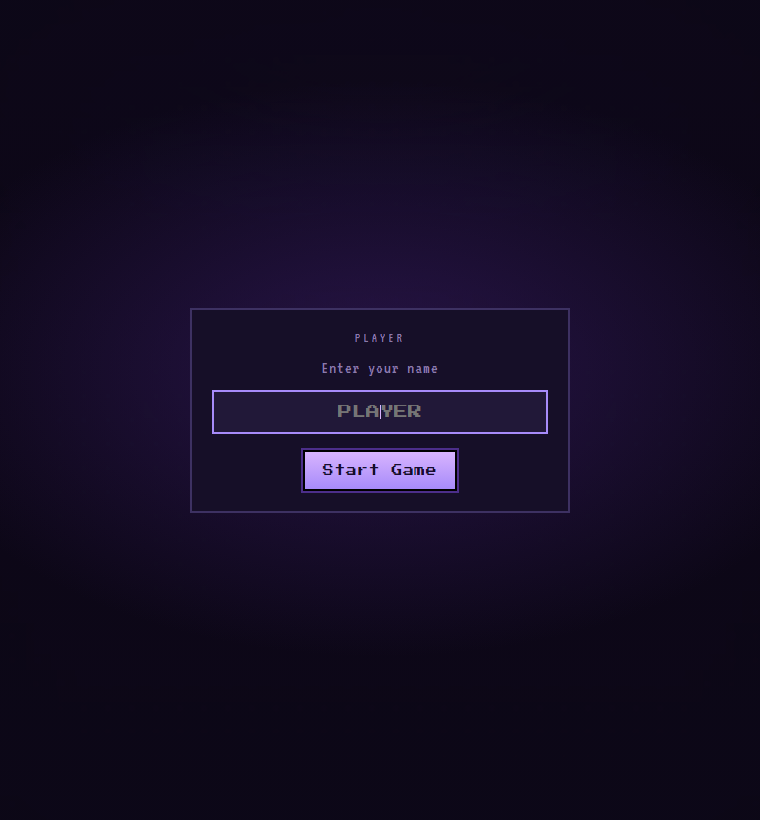
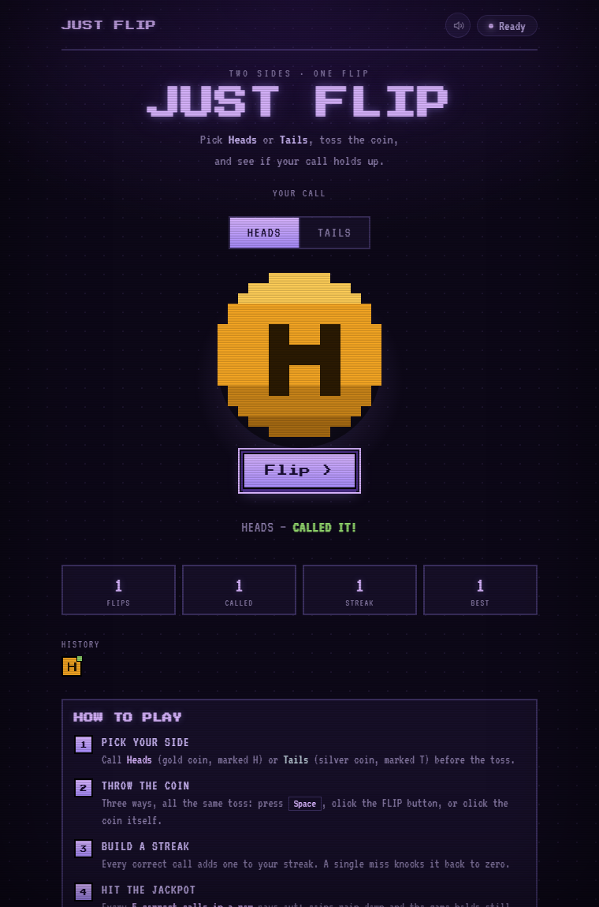
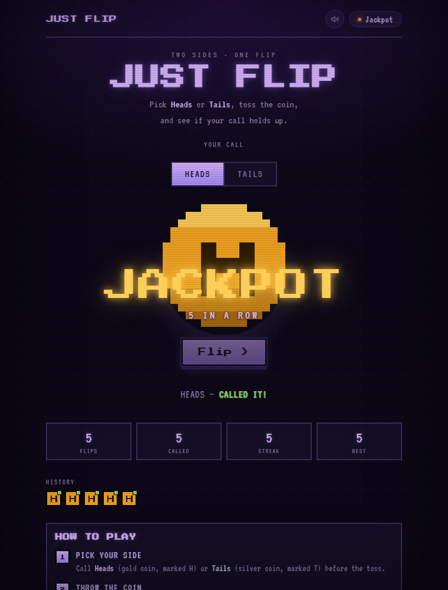

# Just Flip

**Call it in the air. One file, no dependencies.**

A retro arcade coin toss. Call Heads or Tails, throw the coin, and see how long you can keep a streak alive.

**[Play now](https://justflip-coin.github.io/justflipcoin/)** · [How it plays](#how-it-plays) · [Under the hood](#under-the-hood) · [What's next](#whats-next)

Everything is generated by code. No image files, no audio files, no libraries, no build step. The coin is pixel art drawn in the same HTML file, and the music is synthesized while you play.

Download one file, open it, done.

## How it plays

### Loading

A dinosaur runs after a coin and hurdles cacti while the bar fills. It runs to 100% before the enter button lights up.

### Getting in

A verified MetaMask wallet is the way in. You approve the connection, then sign one short message containing a fresh random nonce, which proves whoever is at the keyboard can unlock that account. It is a signature only: no funds move and no transaction is approved.

That proof lives in `sessionStorage`, so closing the tab means verifying again, and a restored session is only accepted while MetaMask still reports the same account. Switching account, locking the wallet or disconnecting ends the run.

Guests can still look around. A guest plays normally but stays off the leaderboard, and the run lives in that browser only.

Worth being plain about the limit: this is a static page with nothing behind it, so the check runs on the player's own machine. It stops casual entry, not someone determined with devtools. Real enforcement needs a server that verifies the signature and issues a token.

### Picking a wallet

The list names what this browser actually announced, so a wallet that never turns up is a fact on screen rather than a guess.

### Your name

Your name is saved with your record. Come in through a wallet and the address becomes the name.

### The board

Pick a side, then throw. On a desktop, press <kbd>Space</kbd>, click FLIP, or click the coin. On a phone, tap the coin or the FLIP button. The hint in the status bar picks its own wording from what the device can actually do.

### The throw

The coin arcs up, tumbles, and lands with a bounce. Gold ring if your call was right, grey if it wasn't.

### Jackpot

Five correct calls in a row pays out. The screen freezes, coins rain down, and a six second fanfare plays. It pays again at 10, 15, and on from there.

## Under the hood

The parts that were harder than they look.

**The coin sound uses inharmonic frequencies.** Metal rings on partials that aren't whole number multiples of the root. That's what separates a real clink from a game blip. The flip is 5 inharmonic partials plus a noise burst for the strike.

**The jackpot melody uses harmonic partials instead.** Inharmonic tones turn to mush the moment you play a tune on them. Two timbres doing two different jobs.

**The flip isn't 3D.** The coin squashes flat, the art swaps while it's thin, then expands. The 3D version was broken for days. A CSS `filter` on the coin silently kills `preserve-3d`, so the Tails face never rendered and every throw showed the same side.

**Music ducks during the jackpot.** The two were fighting for the same space. The moment the funk steps back, the fanfare lands. Smallest change in the build, biggest difference.

**Reduced motion slows animation instead of removing it.** The first version switched it off entirely, which meant the loading screen never appeared at all for those players.

**`window.ethereum` is not how you find MetaMask.** It is one slot every wallet extension writes to, so with two installed the winner is whoever loaded last, and several of them set `isMetaMask` on themselves for compatibility. Discovery goes through EIP-6963 and asks for `io.metamask` by name, with the flag check last rather than first.

**The backdrop was rebuilding fourteen radial gradients every frame.** Measured with a GPU flush, that came to roughly 20ms a frame on its own, against a 16.7ms budget for 60fps. A laptop absorbed it and a phone did not. Each colour is baked into a sprite once now, worth about twenty times, and on touch devices the canvas holds a quarter of the pixels and is stretched back up.

## The leaderboard

Verified wallets write their best streak to a shared board, listed by shortened address. Guests are read only: they can see the board, never join it.

The key in the page is the publishable one, meant to sit in client code. It can read scores and add one, nothing else. That also means a determined person can post a score without playing for it, which is a known gap and the reason the board is worth taking with a pinch of salt until it is verified server side.

## What's next

**Virtual chips.** A bankroll, bets up to All In, and a multiplier that climbs with your streak.

**Server side scores.** Verify the signature and issue a token, so the board reflects runs that actually happened.

**A share button.** Turn your longest streak into an image worth posting.

## License

MIT. Do what you like with it.
