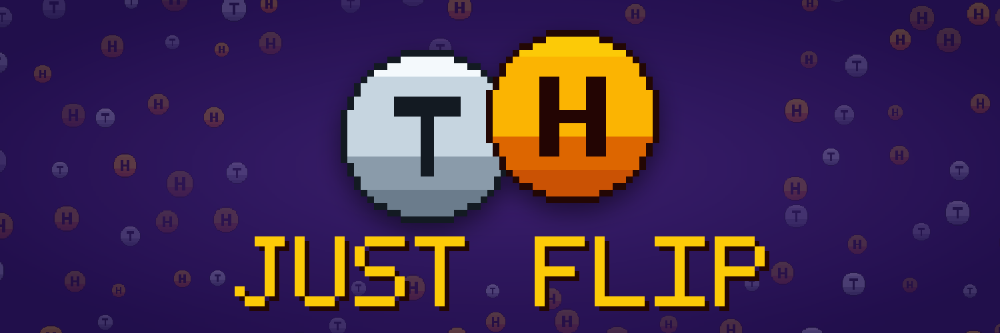
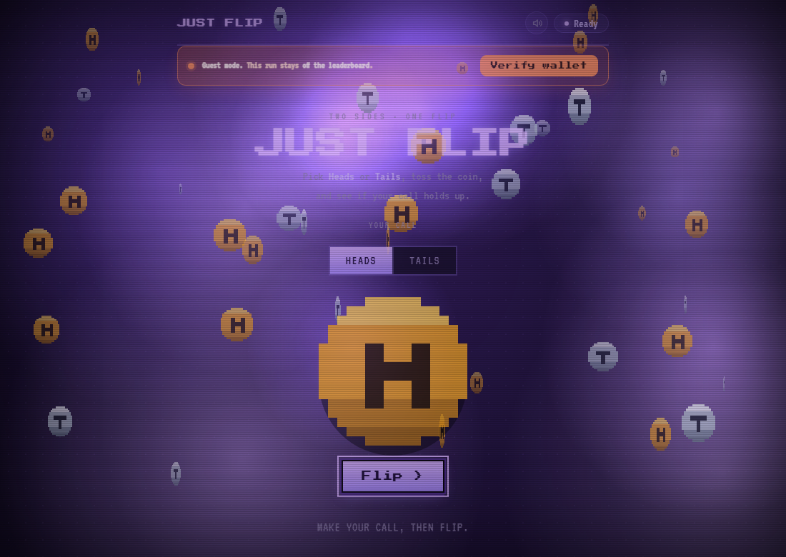
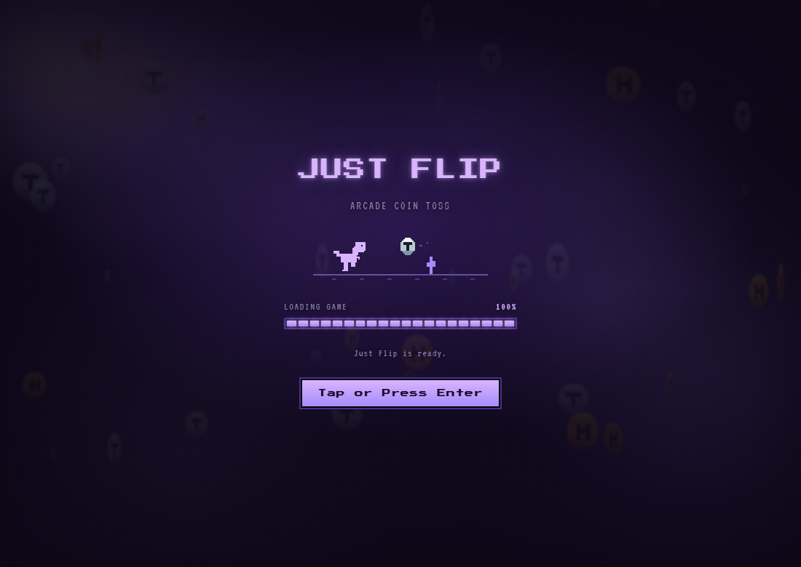
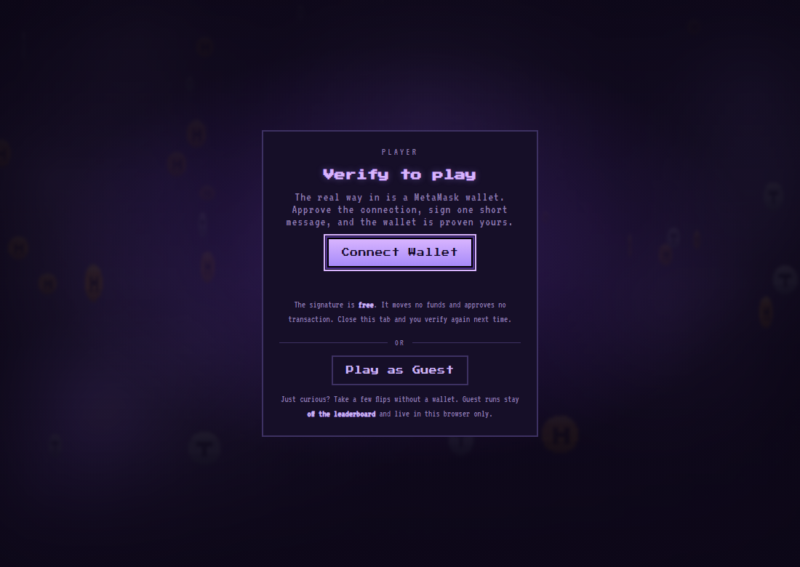
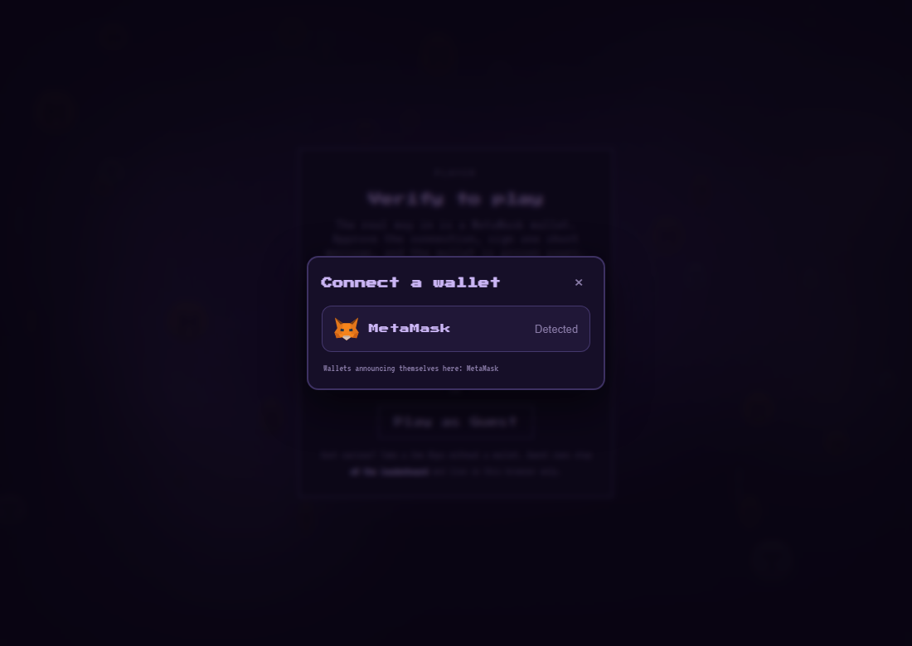

<div align="center">



### Call it in the air.

`one file` &nbsp;·&nbsp; `no dependencies` &nbsp;·&nbsp; `no build step`

<br>

[](https://justflipcoin.xyz)
[](https://github.com/JustFlip-coin/justflipcoin)
[](https://x.com/justflipcoin)

<br>

Pick Heads or Tails, throw the coin, and see how long you can keep a streak alive.

Verified wallets play for the leaderboard. Everyone else can look around as a guest.

<br>


<br>



</div>

<br>

Everything is generated by code. No image files, no audio files, no libraries, no build step. The coin is pixel art drawn in the same HTML file, and the soundtrack is synthesised while you play.

Download one file, open it, done.

<br>

## How it plays

<table>
<tr>
<td width="50%" valign="top">

**Loading**



A dinosaur runs after a coin and hurdles cacti while the bar fills. It reaches 100% before the enter button lights up.

</td>
<td width="50%" valign="top">

**Getting in**



A verified MetaMask wallet is the way in. Guests can still look around, off the leaderboard.

</td>
</tr>
<tr>
<td width="50%" valign="top">

**Picking a wallet**



The list names what this browser actually announced, so a wallet that never turns up is a fact on screen rather than a guess.

</td>
<td width="50%" valign="top">

**The board**


Pick a side, then throw. Press <kbd>Space</kbd>, click FLIP, or tap the coin.

</td>
</tr>
</table>

<br>

## Getting in

A verified MetaMask wallet is the way in. You approve the connection, then sign one short message carrying a fresh random nonce, which proves whoever is at the keyboard can unlock that account. It is a signature only: no funds move and no transaction is approved.

That proof lives in `sessionStorage`, so closing the tab means verifying again, and a restored session is only accepted while MetaMask still reports the same account. Switching account, locking the wallet or disconnecting ends the run.

Guests play normally but stay off the leaderboard, and the run lives in that browser only.

Worth being plain about the limit: this is a static page with nothing behind it, so the check runs on the player's own machine. It stops casual entry, not someone determined with devtools. Real enforcement needs a server that verifies the signature and issues a token. See [SECURITY.md](SECURITY.md).

<br>

## The leaderboard

Verified wallets write their best streak to a shared board, listed by shortened address. Guests are read only: they can see the board, never join it.

The key in the page is the publishable one, meant to sit in client code. It can read scores and add one, nothing else. That also means a determined person can post a score without playing for it, which is a known gap and the reason the board is worth taking with a pinch of salt until it is verified server side.

<br>

## Under the hood

The parts that were harder than they look.

**The coin sound uses inharmonic frequencies.** Metal rings on partials that are not whole number multiples of the root. That is what separates a real clink from a game blip. The flip is five inharmonic partials plus a noise burst for the strike.

**The jackpot melody uses harmonic partials instead.** Inharmonic tones turn to mush the moment you play a tune on them. Two timbres doing two different jobs.

**The flip is not 3D.** The coin squashes flat, the art swaps while it is thin, then expands. The 3D version was broken for days: a CSS `filter` on the coin silently kills `preserve-3d`, so the Tails face never rendered and every throw showed the same side.

**`window.ethereum` is not how you find MetaMask.** It is one slot every wallet extension writes to, so with two installed the winner is whoever loaded last, and several of them set `isMetaMask` on themselves for compatibility. Discovery goes through EIP-6963 and asks for `io.metamask` by name, with the flag check last rather than first.

**The backdrop was rebuilding fourteen radial gradients every frame.** Measured with a GPU flush, that came to roughly 20ms a frame on its own, against a 16.7ms budget for 60fps. A laptop absorbed it and a phone did not. Each colour is baked into a sprite once now, worth about twenty times, and on touch devices the canvas holds a quarter of the pixels and is stretched back up.

**Reduced motion slows animation instead of removing it.** The first version switched it off entirely, which meant the loading screen never appeared at all for those players.

<br>

## Repository

```
index.html   the whole game, one file, no build step
brand/       coin art and the scripts that draw it
press/       media kit: logos, avatars, social sizes, video plates
docs/        screenshots of the running game
```

Both `brand/` and `press/` regenerate from their own scripts. Change a colour, run the script, and the whole set rebuilds.

<br>

## What's next

**Virtual chips.** A bankroll, bets up to All In, and a multiplier that climbs with your streak.

**Server side scores.** Verify the signature and issue a token, so the board reflects runs that actually happened.

**A share button.** Turn your longest streak into an image worth posting.

<br>

## Contributing

Bug reports and pull requests are welcome. [CONTRIBUTING.md](CONTRIBUTING.md) covers how a one-file build works and what to check before opening a PR.

Security problems go through [private reporting](SECURITY.md), never a public issue.

<br>

## License

MIT. Do what you like with it.
